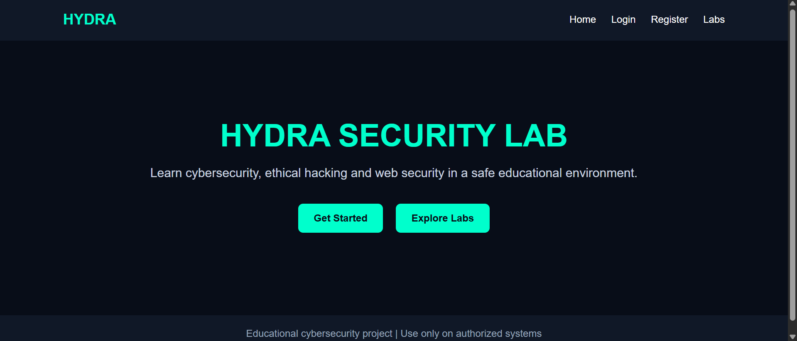
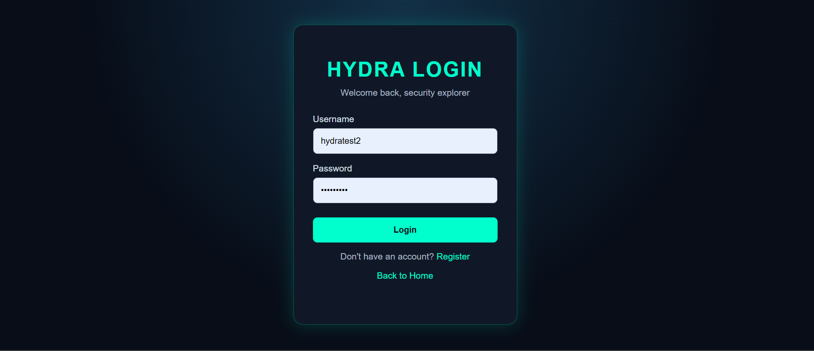
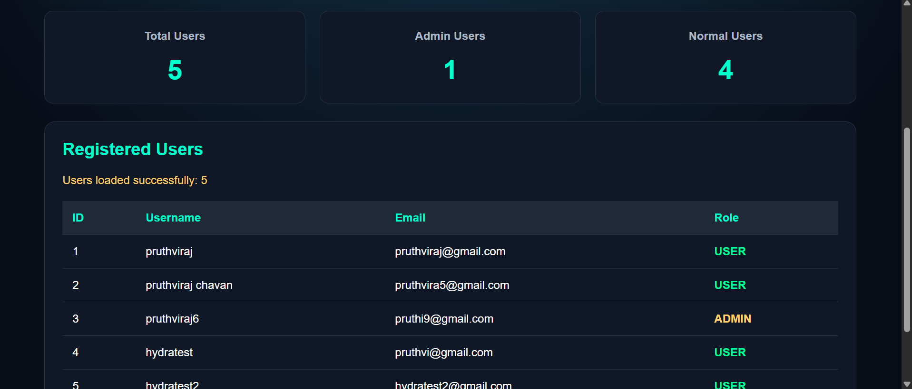
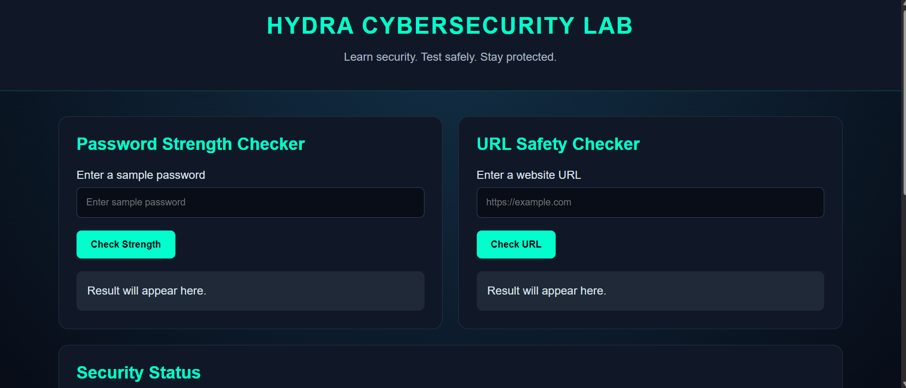

# 🐍 Hydra – Cybersecurity Learning Platform

Hydra is a beginner-friendly cybersecurity learning platform built using Spring Boot, Java, MySQL, HTML, CSS, and JavaScript.

The project provides user registration, login, dashboard, profile management, admin user listing, and basic cybersecurity learning tools.

## 🚀 Features

- User registration
- User login
- Password encryption using BCrypt
- User dashboard
- User profile page
- Admin user listing
- Password strength checker
- URL security checker
- Cybersecurity tips
- MySQL database integration
- Spring Boot REST APIs
- Responsive web pages

## 🛠️ Technologies Used

### Backend
- Java
- Spring Boot
- Spring Security
- Spring Data JPA
- Maven

### Frontend
- HTML5
- CSS3
- JavaScript

### Database
- MySQL

## 📂 Project Structure

```text
hydra/
├── src/
│   └── main/
│       ├── java/
│       │   └── com/pruthviraj/hydra/
│       │       ├── config/
│       │       ├── controller/
│       │       ├── model/
│       │       ├── repository/
│       │       └── service/
│       │
│       └── resources/
│           ├── static/
│           │   ├── index.html
│           │   ├── login.html
│           │   ├── register.html
│           │   ├── dashboard.html
│           │   ├── profile.html
│           │   ├── admin.html
│           │   └── lab.html
│           │
│           └── application.properties
│
├── pom.xml
└── README.md
```

## ⚙️ How to Run the Project

### 1. Clone the repository

```bash
git clone https://github.com/pruthviraj-chavan0o1/hydra.git
```

### 2. Open the project

Open the project in IntelliJ IDEA, Eclipse, or VS Code.

### 3. Configure MySQL

Create a database named:

```sql
CREATE DATABASE hydradb;
```

Update your MySQL username and password in:

```text
src/main/resources/application.properties
```

### 4. Run the project

On Windows PowerShell:

```powershell
.\mvnw.cmd spring-boot:run
```

### 5. Open in browser

```text
http://localhost:8080/
```

## 🔗 Available Pages

| Page | URL |
|---|---|
| Home | `/` |
| Login | `/login.html` |
| Register | `/register.html` |
| Dashboard | `/dashboard.html` |
| Profile | `/profile.html` |
| Cybersecurity Lab | `/lab.html` |
| Admin | `/admin.html` |

## 🔌 API Endpoints

| Method | Endpoint | Description |
|---|---|---|
| GET | `/api/status` | Check backend status |
| POST | `/api/register` | Register a new user |
| POST | `/api/login` | Login user |
| GET | `/api/users` | Get users |
| GET | `/api/admin/users` | Get admin user list |

## 🧪 Cybersecurity Lab

The Lab page includes:

- Password strength checking
- HTTPS and HTTP URL checking
- Basic cybersecurity awareness tips

> Note: The URL checker is a basic educational tool. HTTPS alone does not guarantee that a website is trustworthy.

## 🔐 Security Note

This project is created for learning and demonstration purposes.

Future improvements may include:

- JWT authentication
- Secure session management
- Role-based access control
- Email verification
- Forgot password functionality
- Stronger API validation
- Production-ready security configuration

## 🎯 Future Improvements

- Add real cybersecurity challenges
- Add learning modules
- Add quiz system
- Add progress tracking
- Add vulnerability scanning in a safe lab environment
- Improve admin dashboard
- Deploy the application online

## 👨‍💻 Author

**Pruthviraj Chavan**

- GitHub: [pruthviraj-chavan0o1](https://github.com/pruthviraj-chavan0o1)
- Project: [Hydra](https://github.com/pruthviraj-chavan0o1/hydra)

## ⚠️ Disclaimer

Hydra is an educational cybersecurity project.

Use cybersecurity tools only on systems and websites that you own or have explicit permission to test.

## 📸 Screenshots

### 🏠 Home Page



### 🔐 Login Page



### 📊 Dashboard



### 🧪 Cybersecurity Lab

